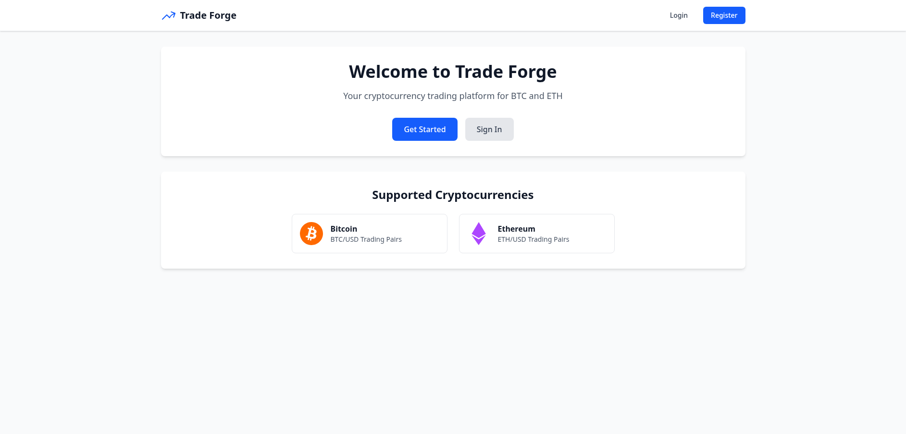
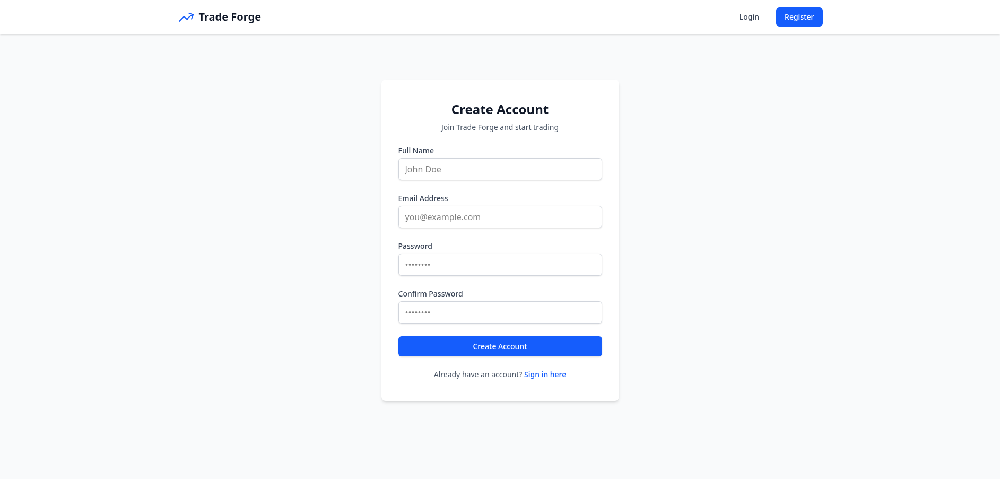
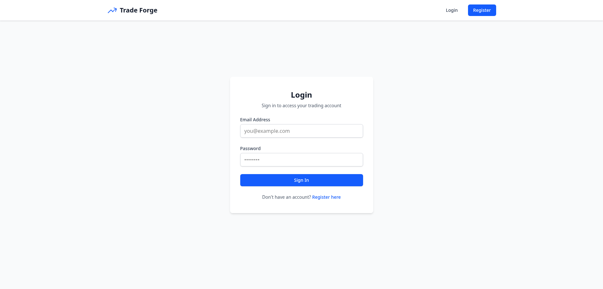
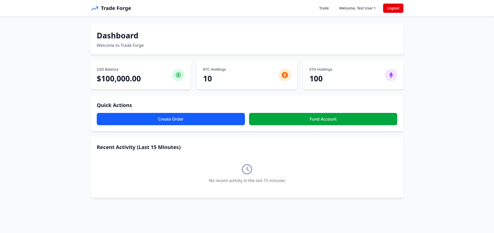
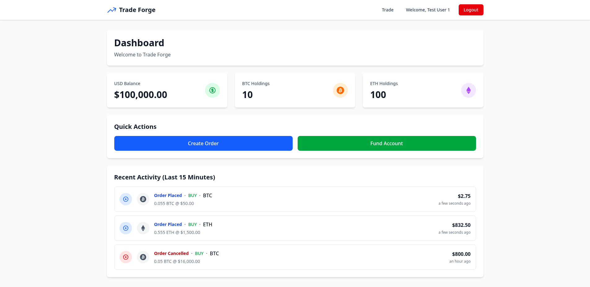
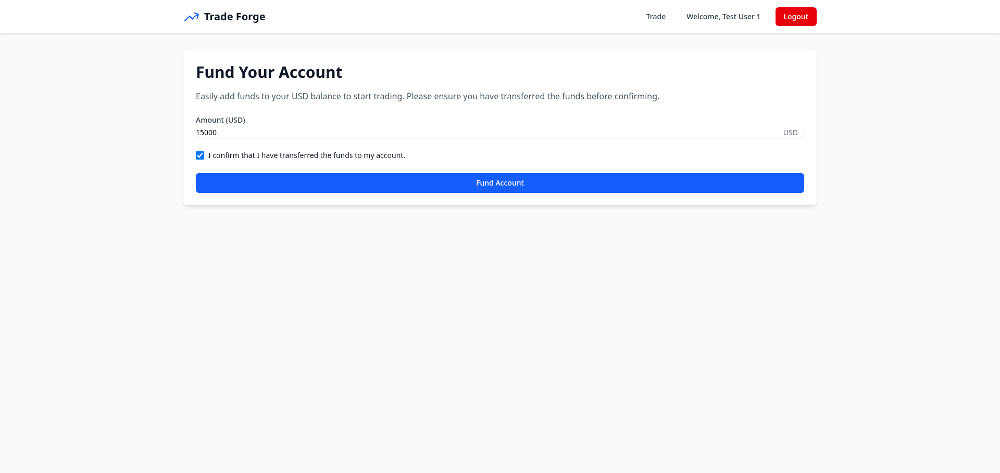
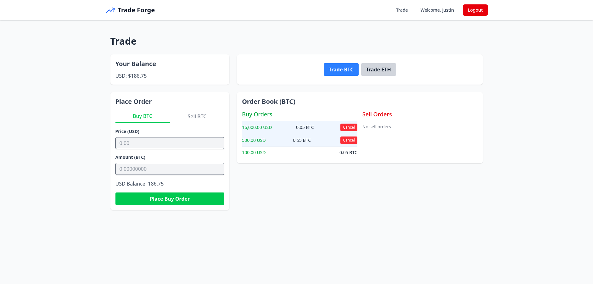
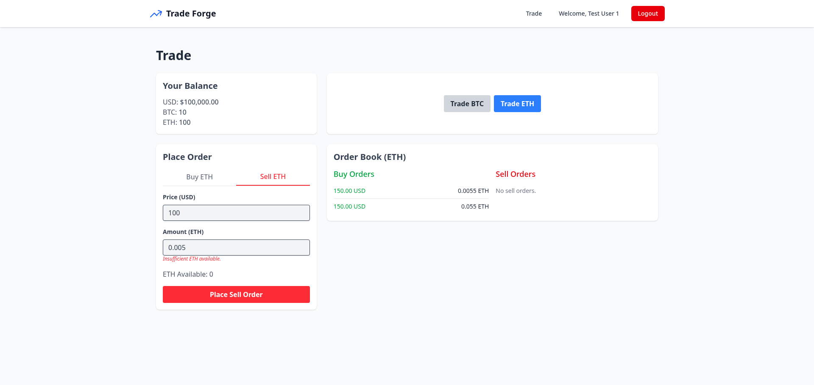

# 📸 Screenshots

## Guest Home Page

The landing page for visitors before authentication.

---

## Authentication

### Registration

Create a new account with email and password.

### Login

Login to your existing account.

---

## Dashboard

### Empty Dashboard

Initial view after first login with no trading activity.

### Dashboard with Activity

Dashboard showing balance, assets, and trading activity.

---

## Account Management

### Fund Account

Add USD funds to your account balance.

---

## Trading Interface

### Buy Order (BTC)

Place a buy order for Bitcoin with price and amount inputs.

### Sell Order (ETH)

Place a sell order for Ethereum with calculated proceeds.

